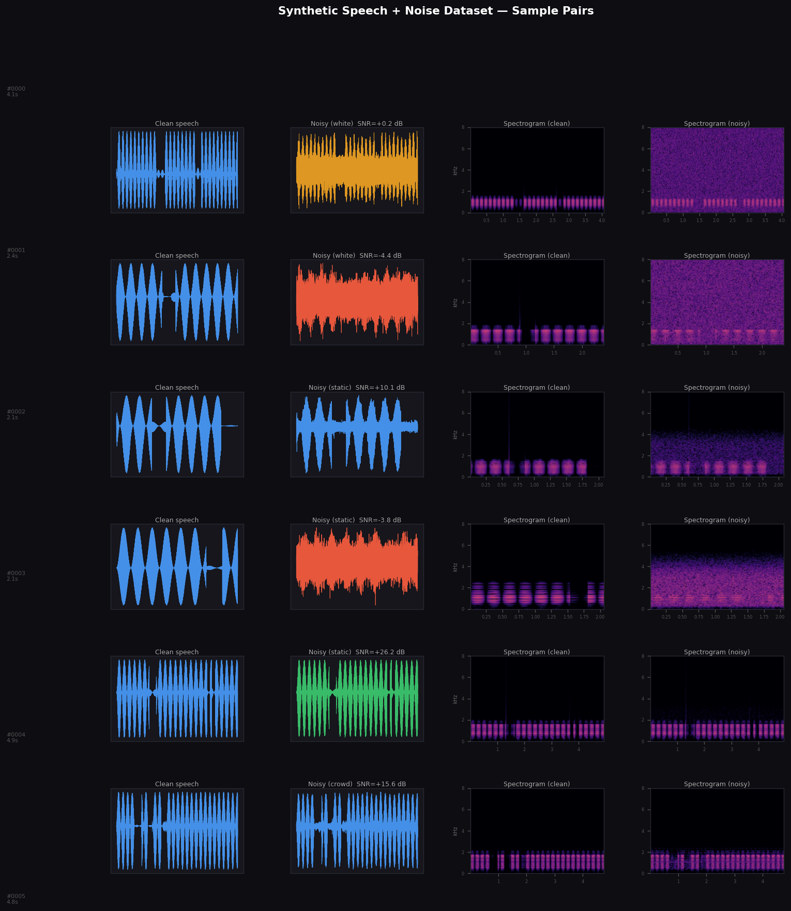
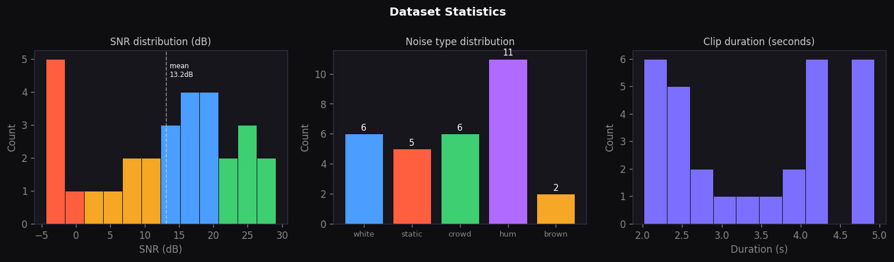

# 🎙️ Synthetic Speech + Noise Dataset Generator

> A Python pipeline that procedurally generates labeled speech + background noise audio pairs for training speech AI models — no microphone, no actors, no manual labeling required.



---

## What This Is

Training speech recognition and noise cancellation models requires thousands of audio samples across a wide range of noise conditions. Collecting and labeling real recordings is slow and expensive.

This pipeline automates the full process:

**Synthesize speech → Generate noise → Mix at target SNR → Export dataset**

Every sample ships as a clean/noisy pair with ground-truth labels — the exact format used to train models like OpenAI Whisper, Mozilla DeepSpeech, and Facebook Demucs.

---

## Dataset Stats

| Metric | Value |
|---|---|
| Total samples | 30 |
| Total audio duration | ~101 seconds |
| Sample rate | 16,000 Hz (16kHz) |
| SNR range | −5 dB to +30 dB |
| Noise types | 5 |
| Files per sample | 3 (clean, noisy, noise-only) |
| Annotation format | JSON (SNR, RMS, noise type, duration) |

**Noise types:** `white` · `brown` · `crowd babble` · `electrical hum` · `static`



---

## Pipeline Overview

```
generate_audio_dataset.py
│
├── [1] Speech synthesis
│     ├── Formant synthesis (F0 + harmonics)
│     ├── Vocal tract filter (F1/F2/F3 resonances)
│     └── Syllable-level amplitude envelope with natural pauses
│
├── [2] Noise generation
│     ├── White noise      — flat spectrum random signal
│     ├── Brown noise      — integrated white noise (1/f² spectrum)
│     ├── Crowd babble     — overlapping synthesized voices
│     ├── Electrical hum   — 60 Hz harmonics (common in cheap gear)
│     └── Static           — bandlimited mid-frequency noise
│
├── [3] SNR mixing
│     ├── Target SNR sampled uniformly from −5 to +30 dB
│     ├── Noise scaled analytically to hit exact SNR
│     └── Peak normalization to prevent clipping
│
└── [4] Export
      ├── output/audio/clean/       ← clean speech WAVs
      ├── output/audio/noisy/       ← speech + noise at target SNR
      ├── output/audio/noise_only/  ← isolated noise signals
      ├── output/labels.json        ← full annotation file
      ├── output/summary.png        ← waveform + spectrogram grid
      └── output/stats.png          ← dataset statistics
```

---

## Output Structure

```
output/
├── audio/
│   ├── clean/
│   │   ├── sample_0000_clean.wav
│   │   └── ...
│   ├── noisy/
│   │   ├── sample_0000_noisy.wav
│   │   └── ...
│   └── noise_only/
│       ├── sample_0000_noise.wav
│       └── ...
├── labels.json
├── summary.png
└── stats.png
```

### labels.json format

```json
{
  "sample_id": 0,
  "duration_sec": 4.06,
  "sample_rate": 16000,
  "snr_db": 0.21,
  "noise_type": "white",
  "speech_rms_db": -11.3,
  "noisy_rms_db": -8.7,
  "files": {
    "clean": "output/audio/clean/sample_0000_clean.wav",
    "noisy": "output/audio/noisy/sample_0000_noisy.wav",
    "noise_only": "output/audio/noise_only/sample_0000_noise.wav"
  }
}
```

---

## Quickstart

**Requirements:** Python 3.8+ · `numpy` · `scipy` · `matplotlib`

```bash
# Clone the repo
git clone https://github.com/YOUR_USERNAME/synthetic-audio-dataset-generator
cd synthetic-audio-dataset-generator

# Install dependencies
pip install numpy scipy matplotlib

# Generate the dataset
python generate_audio_dataset.py
```

**To scale up**, edit the config at the top of the script:

```python
NUM_SAMPLES    = 10000        # generate as many as you need
DURATION_RANGE = (1.0, 10.0)  # seconds per clip
SNR_RANGE      = (-10, 35)    # dB range
SAMPLE_RATE    = 22050        # higher quality
```

---

## Loading into PyTorch

```python
import json
import torch
import torchaudio
from torch.utils.data import Dataset

class SpeechNoiseDataset(Dataset):
    def __init__(self, labels_path):
        with open(labels_path) as f:
            data = json.load(f)
        self.samples = data["samples"]

    def __len__(self):
        return len(self.samples)

    def __getitem__(self, idx):
        s = self.samples[idx]
        clean, sr = torchaudio.load(s["files"]["clean"])
        noisy, _  = torchaudio.load(s["files"]["noisy"])
        return {
            "clean":      clean,
            "noisy":      noisy,
            "snr_db":     torch.tensor(s["snr_db"], dtype=torch.float32),
            "noise_type": s["noise_type"],
        }

# Usage
dataset = SpeechNoiseDataset("output/labels.json")
loader  = torch.utils.data.DataLoader(dataset, batch_size=16, shuffle=True)
```

---

## Why Synthetic Audio Data?

| | Real recordings | This pipeline |
|---|---|---|
| Collection cost | Studio time + actors | Zero |
| Labeling cost | Manual annotation | Automatic |
| SNR control | Approximate | Exact (analytical) |
| Scale | Limited | Unlimited |
| Noise variety | Hard to reproduce | Fully controllable |
| Privacy concerns | Speaker consent needed | None |

Synthetic audio generation is foundational to how major speech AI systems are built — models trained on synthetic noisy/clean pairs generalize better to real-world conditions than models trained on clean speech alone.

---

## Roadmap

- [ ] Add reverberation (room impulse response convolution)
- [ ] Export mel spectrograms as `.npy` for direct model input
- [ ] Support real speech samples as source (LibriSpeech compatible)
- [ ] Add pitch and speed augmentation
- [ ] Integrate with LMMS/Ardour for physics-accurate acoustic simulation
- [ ] Train baseline RNN noise suppression model on generated data

---

## Tech Stack

`Python` · `NumPy` · `SciPy` · `Matplotlib`

Concept inspired by speech enhancement research and sim2real audio pipelines used in production ASR (automatic speech recognition) systems.

---

*Built as part of an exploration into AI training data pipelines for speech and audio models.*
